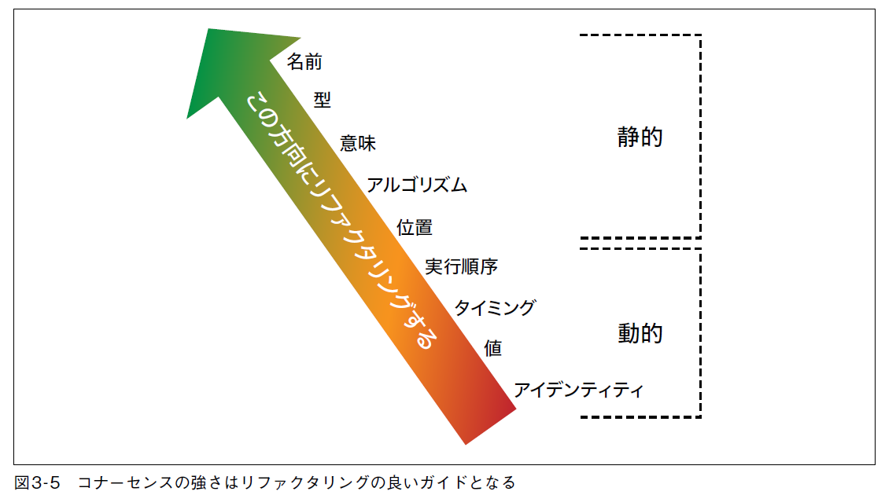

<!-- omit in toc -->
# 目次

- [第ゼロ部](#第ゼロ部)
  - [1. イントロダクション](#1-イントロダクション)
- [第一部 基礎](#第一部-基礎)
  - [2. アーキテクチャ思考](#2-アーキテクチャ思考)
  - [3. モジュール性](#3-モジュール性)
  - [4. アーキテクチャ特性](#4-アーキテクチャ特性)
  - [5. アーキテクチャ特性を明らかにする](#5-アーキテクチャ特性を明らかにする)
  - [6. アーキテクチャ特性の計測と統制](#6-アーキテクチャ特性の計測と統制)
  - [7. アーキテクチャ特性のスコープ](#7-アーキテクチャ特性のスコープ)
  - [8. コンポーネントベース思考](#8-コンポーネントベース思考)
- [第二部 アーキテクチャスタイル](#第二部-アーキテクチャスタイル)
  - [9. 基礎](#9-基礎)
  - [10. レイヤードアーキテクチャ](#10-レイヤードアーキテクチャ)
  - [11. パイプラインアーキテクチャ](#11-パイプラインアーキテクチャ)
  - [12. マイクロカーネルアーキテクチャ](#12-マイクロカーネルアーキテクチャ)
  - [13. サービスベースアーキテクチャ](#13-サービスベースアーキテクチャ)
  - [14. イベント駆動アーキテクチャ](#14-イベント駆動アーキテクチャ)
  - [15. スペースベースアーキテクチャ](#15-スペースベースアーキテクチャ)
  - [16. オーケストレーション駆動サービス指向アーキテクチャ](#16-オーケストレーション駆動サービス指向アーキテクチャ)
  - [17. マイクロサービスアーキテクチャ](#17-マイクロサービスアーキテクチャ)
  - [18. 適切なアーキテクチャスタイルを選ぶ](#18-適切なアーキテクチャスタイルを選ぶ)
- [第三部 テクニックとソフトスキル](#第三部-テクニックとソフトスキル)
  - [19. アーキテクチャ決定](#19-アーキテクチャ決定)
  - [20. アーキテクチャ上のリスクを分析する](#20-アーキテクチャ上のリスクを分析する)
  - [21. アーキテクチャの図解やプレゼンテーション](#21-アーキテクチャの図解やプレゼンテーション)
  - [22. 効果的なチームにする](#22-効果的なチームにする)
  - [23. 交渉とリーダーシップのスキル](#23-交渉とリーダーシップのスキル)
  - [24. キャリアパスを開く](#24-キャリアパスを開く)

# 第ゼロ部

## 1. イントロダクション

ソフトウェアアーキテクチャは下記4要素から構成

- **システム構造**： アーキテクチャスタイルの種類
  - 例）マイクロサービスやレイヤード、マイクロカーネルなど
- **アーキテクチャ特性**：システムの成功基準を定めるもの
  - 例）可用性、信頼性、テスト容易性、スケーラビリティ、セキュリテ、アジリティ、耐障害性、弾力性、回復性、パフォーマンス、デプロイ容易性、学習容易性など
- **アーキテクチャ決定**：開発指針になるルールを定める
  - 例）データアクセスの制限ルールを定める
    - DB直接アクセス可能：ビジネス層とサービス層
    - DB直接アクセス不可：プレゼンテーション層
- **設計指針**：アーキテクチャ決定よりも緩いガイドライン
  - 例）サービス間の通信はパフォーマンス面から非同期メッセージングを利用を優先など

# 第一部 基礎

## 2. アーキテクチャ思考

アーキテクチャ思考には４つの側面がある

- **アーキテクチャと設計の違い**
  - アーキテクチャ
    - ビジネス要件を分析してアーキテクチャ特性を定義し、システム構造を選択肢、コンポーネント構造を作成
  - 設計
    - 各コンポーネントのクラス図やUIを設計
- **幅広い技術知識**
  - 知識には3段階あり、1.2.の領域の知識を増やす
    - 1.わかっていること、2.わかっていないとわかっていること、3.わかっていないこともわかっていないこと
  - 古い知識を再選択であると勘違いしないために随時アップデート
- **トレードオフの理解・分析・調整**
  - 全ての技術はトレードオフであり、利点だけでなく、マイナス面も分析する
- **ビジネスドライバーの重要性を理解**
  - ビジネス要件からアーキテクチャ特性を定義
  - 技術面だけでなくドメイン知識やステークホルダーとの関係性維持も重要

**アーキテクティングとコーディングのバランスを取る**
すべてのアーキテクトは下記方法などでコードを書き、一定のレベルの技術的な深さは維持すべき

**PoCを頻繁に実施**
アーキテクトが2つの手法で悩んでいた場合に、それぞれのサンプルを開発して比較検証を実施
その際、出来ればプロダクトレベルのコードを開発
なぜならば、開発者のリファレンスになってしまうから

## 3. モジュール性

モジュール性の計測には下記3点を用いる

- **凝集度**
  - 関連する要素がすべて一か所にまとまっている状態が理想
- **結合度**
- **コナーセンス**
  - 複数のモジュール間で合意しなければならないこと
    - 静的：名前、型、意味、位置、アルゴリズム
    - 動的：実行順序、タイミング、値、アイデンティティ

出来るだけ動的など下のコナーセンスをなくすことが良い
例）マジックナンバーなど意味のコナーセンスを定数にすることで名前のコナーセンスにリファクタする

## 4. アーキテクチャ特性

アーキテクチャ特性には普遍的な標準は存在しない。
下記ではその内いくつかの例を示す。

アーキテクチャの運用特性

- **可用性**(Availability)
  - システムがどのくらいの期間利用できるか、SLAなど稼働率で示す。可用性を高めるために下記の継続性や回復性が必要
- **回復性**/**継続性**(Recoverability/Continuity)
  - 障害発生後に正常な状態に戻る時間を示す。処理の持続性要件、これはバックアップ戦略とハードウェアの複製の要件に影響する
- **パフォーマンス**(Performance)
  - ストレステスト、ピーク分析、使われる機能の使用頻度、必要となる容量、応答時間の分析などが含まれる
- **スケーラビリティ**(Scalability)
  - ユーザ数やリクエスト数が増えてもシステムが動作する能力
- **安全性**(Safety)
  - システムがユーザや環境に対して安全であることを示す。
    - 情報漏洩などのセキュリティ対策やリスク管理、障害発生時に暴走せずに緊急停止人出来るかなど
- **堅牢性**(Robustness)
  - 実行中にインターネット接続が切れた場合や、停電やハードウェア障害が発生した場合に、エラーや境界条件を処理できるかどうか

アーキテクチャの構造特性

- **構成容易性**(Configurability)
  - システムの設定を簡単に変更できること
- **拡張性**(Extensibility)
  - 新しい機能をプラグインで追加できること
- **活用性**/**再利用性**(Leverageability/Reuse)
  - 複数の製品で共通のコンポーネントを利用できること
- **ローカライゼーション**(Localization)
  - 入出力画面でマルチバイト文字に対応や複数通貨や言語に対応していること
- **メンテナンス性**(Maintainability)
  - 変更の適用やシステムの拡張がどれだけ簡単に実施できるか
- **可搬性**(Portability)
  - 複数のプラットフォームで動作する必要があるか
- **アップグレード容易性**(Upgradeability)
  - アップグレードが簡単/迅速にできるか

アーキテクチャの横断的特性

- **アクセシビリティ**(Accessibility)
  - 色覚障害や難聴などの障害を持つユーザを含め、アクセスしやすいか
- **長期保存性**(Archivability)
  - 一定期間後にデータをアーカイブまたは削除する必要があるか
- **認証**(Authentication)
  - ユーザが何者か確認する必要があるか
- **認可**(Authorization)
  - ユーザが特定の機能のみにアクセス出来ることを保証する必要があるか
- **合法性**(Legal)
  - 法的制約はあるのか
- **プライバシー**(Privacy)
  - 運用者などの従業員からデータの中身を隠せているか
- **セキュリティ**(Security)
  - DBや通信を暗号化する必要があるか、認証は必要か
- **サポート容易性**(Supportability)
  - 技術サポートが必要か、デバッグするためにはログをどのレベルで整えておく必要があるか
- **ユーザビリティ**(Usability)
  - ユーザが利用するためにはどの程度のトレーニングが必要か

ISOの能力別に整理されたアーキテクチャ特性リスト

- **パフォーマンス効率**：パフォーマンスの指標
  - 時間的挙動：応答、処理時間、スループット
  - リソース利用率：リソースの種類と量
  - 容量：設定された最大限度
- **互換性**：製品・システム・コンポーネントが他と情報を交換、機能の実行しながら環境を共有できる度合
  - 共存可能性：他製品と環境と資源を共有しながら実行できるか
  - 相互運用性：複数システムを統合して情報のやりとりなどを実行すること
- **ユーザビリティ**：ユーザが意図した目的を達成できるか
  - 適切認識可能性：ニーズにあっているか認識できること
  - 学習容易性：簡単に習得できるか
  - ユーザエラー防止率：ユーザがエラーを起こさないようにすること
  - アクセシビリティ：幅広い特性や能力の人が利用できること
- **信頼性**：特定の条件下でシステムが機能する度合
  - 成熟度：通常の運用において信頼性を満たしているか
  - 可用性：動作し、アクセス可能であるか
  - 耐障害性：障害発生時も動作できるか
  - 回復性：障害から回復し、影響を受けたデータも回復できるか
- **セキュリティ**：権限レベル毎のアクセス、情報の保護の程度
  - 機密性：アクセス権を持つ者のみがアクセス出来るか
  - 完全性：不正アクセスや変更を防止できるか
  - 立証性：アクション・イベントログを残せるか
  - 責任追跡性：ユーザのアクションログを追跡できるか
  - 認証可能性：ユーザの身元を照明できるか
- **保守容易性**：改良・修正・適応を効率的に出来るか
  - モジュール性：適切なコンポーネントに分離出来ているか
  - 再利用性：他システムに流用出来るか
  - 分析容易性：指標となる数値を簡単に収集できるか
  - 修正容易性：デグレすることなく修正することができるか
  - テスト容易性：簡単にテストえきるか
- **可搬性**：別環境への移行しやすさ
  - 適応可能性：ハードウェアをアップデートした場合などの移行しやすさ
  - インストール可能性：インストール・アンインストールしやすいか
  - 置換可能性：どれだけ簡単に機能を他ソフトウェアに置き換えられるか

## 5. アーキテクチャ特性を明らかにする

## 6. アーキテクチャ特性の計測と統制

## 7. アーキテクチャ特性のスコープ

## 8. コンポーネントベース思考

# 第二部 アーキテクチャスタイル

## 9. 基礎

## 10. レイヤードアーキテクチャ

## 11. パイプラインアーキテクチャ

## 12. マイクロカーネルアーキテクチャ

## 13. サービスベースアーキテクチャ

## 14. イベント駆動アーキテクチャ

## 15. スペースベースアーキテクチャ

## 16. オーケストレーション駆動サービス指向アーキテクチャ

## 17. マイクロサービスアーキテクチャ

## 18. 適切なアーキテクチャスタイルを選ぶ

# 第三部 テクニックとソフトスキル

## 19. アーキテクチャ決定

## 20. アーキテクチャ上のリスクを分析する

## 21. アーキテクチャの図解やプレゼンテーション

## 22. 効果的なチームにする

## 23. 交渉とリーダーシップのスキル

## 24. キャリアパスを開く
